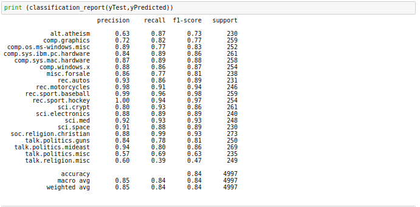
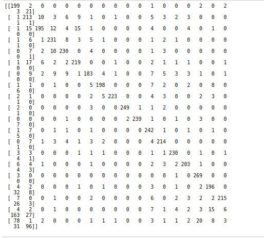

# MULTINOMIAL NAIVE BAYES IMPLEMENTATION

This project shows the implementation of Multinomial Naive Bayes Algorithm on 20newsgroup dataset.Here I compared the results of my implemetation with the sklearn's implementation of multinomial naive bayes.

## MY IMPLEMENTATION ANALYSIS

## SCREENSHOTS

## INBUILT SKLEARN MULTINOMIAL NAIVE BAYES ANALYSIS

## SCREENSHOTS

